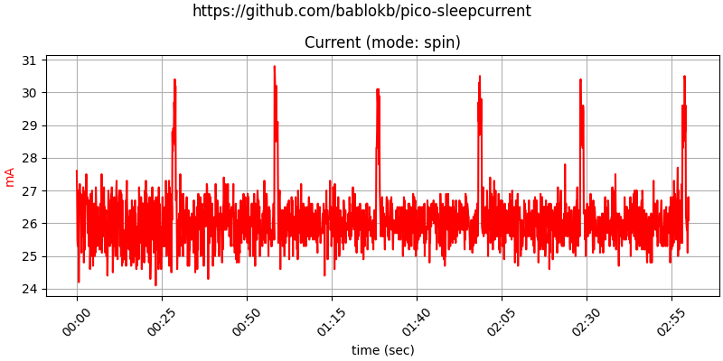
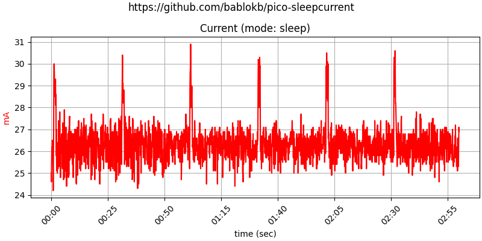
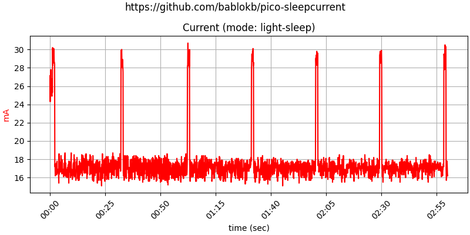
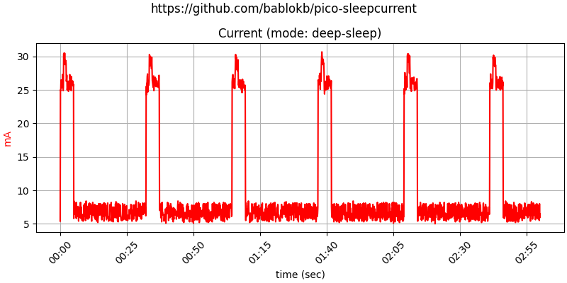
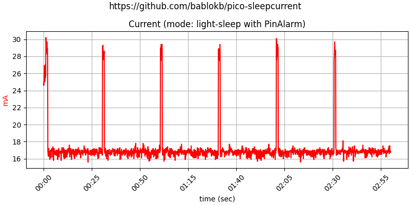
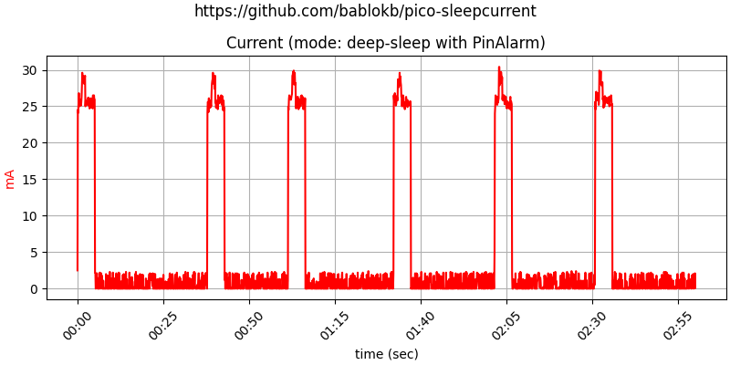
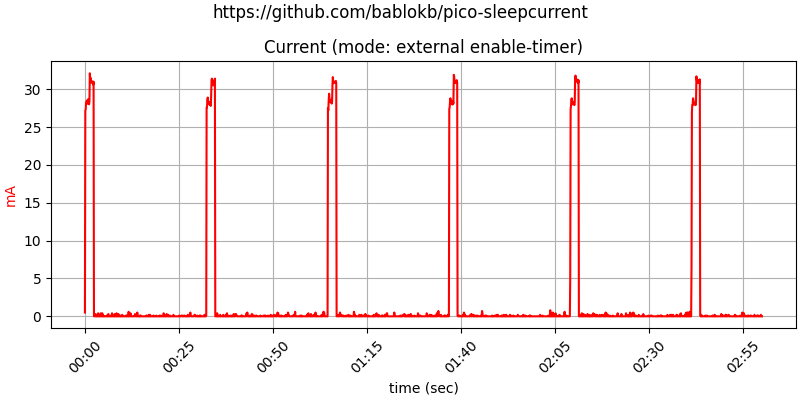

Overview
========

This repository contains a number of test-programs to demonstrate
and measure current-consumption of the Pi Pico during sleep.

You can find the various programs in the subdirectories of this
repository. To install, just copy the contents of the directory to
the device.

There are a few programs which require additional libraries. The easiest
way to install these libs is using circup (which you can install via pip).
E.g.:

    circup --path path-to-pico install -r cp-memory/requirements.txt

Results
=======

All programs simulate "work" with the on-board LED or neopixel (one second
on within every 30 seconds). Inbetween the pico goes to sleep and uses
various methods to wake up again (e.g. TimerAlarm, PinAlarm, 3V3_EN-pin).

Measurements were performed using the project
<https://github.com/bablokb/circuitpython-vameter> and plotted with
<https://github.com/bablokb/py-datamon>.

Spinning
--------

In this mode, the program just uses an active loop to "sleep":

Sleep
-----

Here the program uses `time.sleep()`. There is no difference to spinning,
since the pico-SDK implements sleeping with a busy-loop.

Timer Light-Sleep
-----------------

This will reduce current consumption considerably. Note that the RTC keeps
its time during sleep.

Timer Deep-Sleep
-----------------

This will reduce current consumption even more. The drawback is that the RTC
looses its time after wakeup. Also, the restart consumes additional current.

Pin Light-Sleep
---------------

This is comparable to timer-based light-sleep. The only thing to notice is
the reduced noise.

Pin Deep-Sleep
--------------

This is the best option you have (if you don't need to keep the RTC-state).
Recommendation: use an external RTC to drive the pin-alarm and update the
internal RTC after restart.

3V3_EN pin
----------

With additional circuitry, you can control the pico via the 3V3_EN-pin
(physical pin 37). The simplest solution is to use Adafruit's
[TPL5111 enable-timer-breakout](https://adafru.it/3573). An example program
is in [cp-enable/main.py](cp-enable/main.py).

