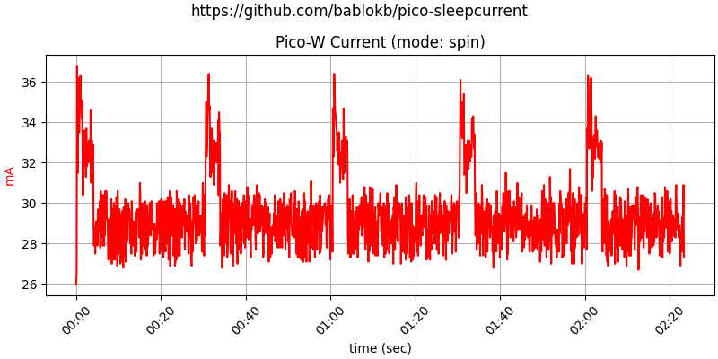

Overview
========

This repository contains a number of test-programs to demonstrate
and measure current-consumption of the Pi Pico during sleep.

You can find the various programs in the subdirectories of this
repository. To install, just copy the contents of the directory to
the device.

There are a few programs which require additional libraries. The easiest
way to install these libs is using circup (which you can install via pip).
E.g.:

    circup --path path-to-pico install -r cp-memory/requirements.txt

New Results
===========

I (re)implemented CircuitPython light-sleep/deep-sleep for the RP2040
and RP2350. With the reimplementation, light-sleep levels are down to
deep-sleep levels (e.g. from 15mA to 1.6mA). You can read about the
results here: [./pico_pico2_current.md](./pico_pico2_current.md).

The [PR for CircuitPython](https://github.com/adafruit/circuitpython/pull/10023)
was *not* accepted, mainly for two reasons:

  - it changes semantics within a major revision (in this case 9.x.x)
  - it prioritizes power-saving versus "keep every thing running" in
    light-sleep mode. Read the discussion of the PR to gain an
    understanding of the background.

The first problem could be solved with the start of the new 10.x.x
development cycle. The second problem is more of a philisophical issue:
I don't think it makes sense to "keep things running" when requesting
sleep - this is contradictory, since using light-sleep instead of normal
time.sleep() is for maximising power-savings and you can't sleep and work
at the same time. Implementing these phantasies would be hard work with
almost no effect and certainly no practical use.

Anyone needing alarms and advanced sleep modes for the RP2350 (or
improved light-sleep for the RP2040) can download and apply the
necessary patch from
[here](https://github.com/bablokb/circuitpython-patches).

Old Results
===========

All programs simulate "work" with the on-board LED or neopixel (one second
on within every 30 seconds). Inbetween the pico goes to sleep and uses
various methods to wake up again (e.g. TimerAlarm, PinAlarm, 3V3_EN-pin).

Measurements were performed using the project
<https://github.com/bablokb/circuitpython-vameter> and plotted with
<https://github.com/bablokb/py-datamon>.

Note that these are results with older versions of CircuitPython. With
CircuitPython 8.2.0, current consumption is generally lower and there
is now a difference between spinning and sleeping. Also, starting with
8.2.0, CircuitPython supports changing the cpu-frequency. Minimizing
the frequency before going to sleep will result in even lower values.

The following sections will be updated (hopefully soon) to reflect the
new results.

Spinning
--------

In this mode, the program just uses an active loop to "sleep":

Early data for the Pico-W (CircuitPython-8.0.0-beta.1):

Sleep
-----

Here the program uses `time.sleep()`. There is no difference to spinning,
since the pico-SDK implements sleeping with a busy-loop.

Timer Light-Sleep
-----------------

This will reduce current consumption considerably. Note that the RTC keeps
its time during sleep.

Early data for the Pico-W (CircuitPython-8.0.0-beta.1):

Timer Deep-Sleep
-----------------

This will reduce current consumption even more. The drawback is that the RTC
looses its time after wakeup. Also, the restart consumes additional current.

Early data for the Pico-W (CircuitPython-8.0.0-beta.1):

Pin Light-Sleep
---------------

This is comparable to timer-based light-sleep. The only thing to notice is
the reduced noise.

Pin Deep-Sleep
--------------

This is the best option you have (if you don't need to keep the RTC-state).
Recommendation: use an external RTC to drive the pin-alarm and update the
internal RTC after restart.

3V3_EN pin
----------

With additional circuitry, you can control the pico via the 3V3_EN-pin
(physical pin 37). The simplest solution is to use Adafruit's
[TPL5111 enable-timer-breakout](https://adafru.it/3573). An example program
is in [cp-enable/main.py](cp-enable/main.py).

